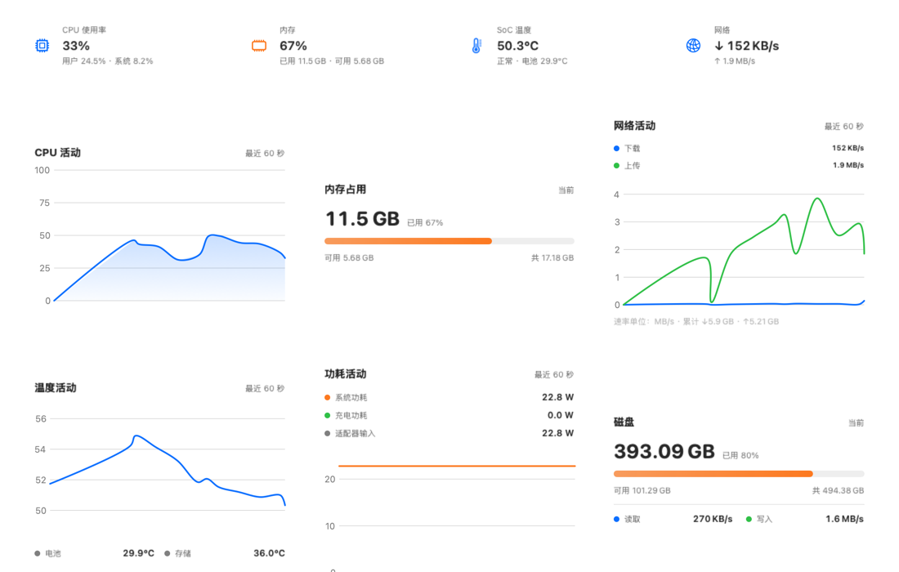
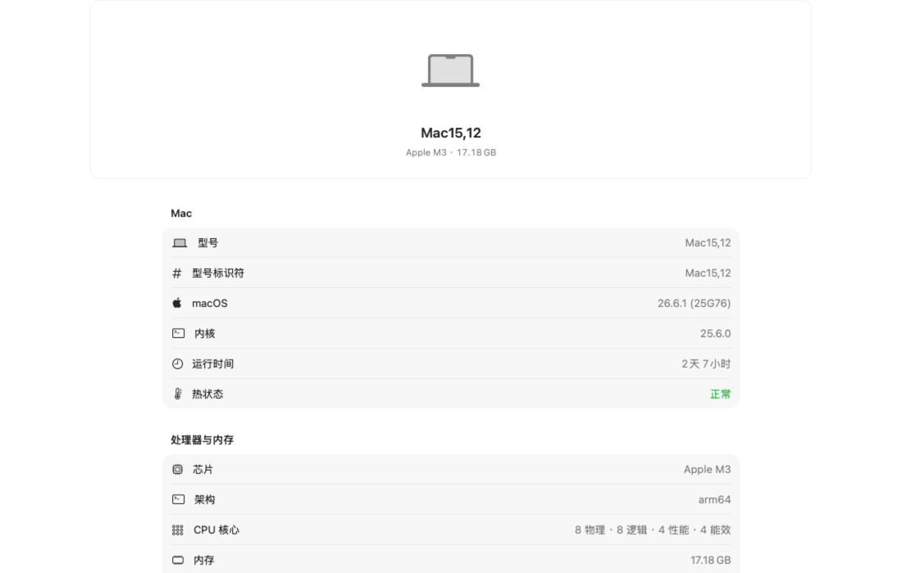
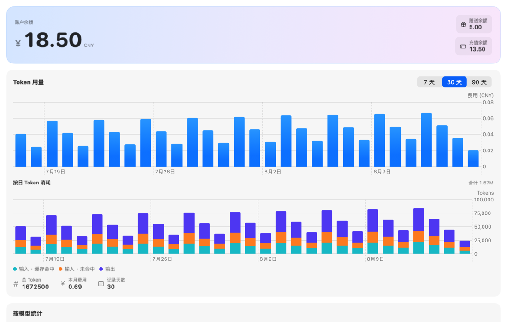
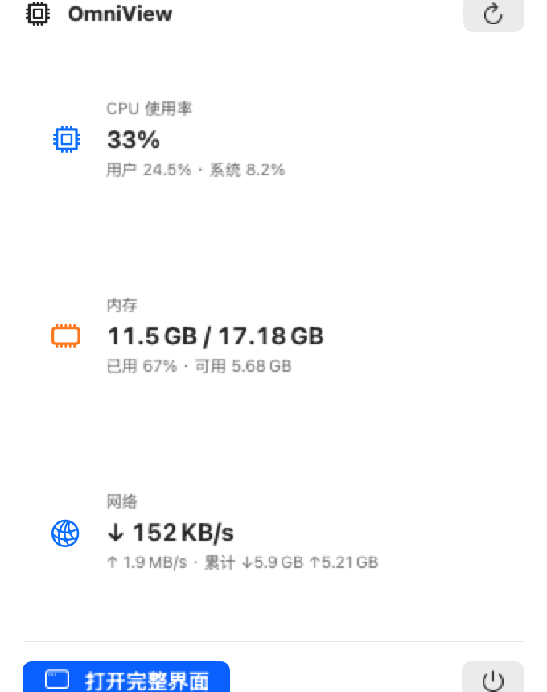

# OmniView

macOS 菜单栏仪表盘：实时系统监控、ZJU 学习助手（日历 / 作业 / 课件）与 DeepSeek 余额用量监控。

应用以菜单栏常驻运行（无 Dock 图标），使用 SwiftUI 编写，最低支持 macOS 14。

## 界面预览







菜单栏状态项与点击后的弹出面板：




## 功能

### 菜单栏

- **实时指标**：状态项以 3 列 × 2 行显示网络上下行速率、CPU、内存，默认每秒采样一次：

  ```
  ↑ 1.2M  CPU   内存
  ↓ 38K   21%   67%
  ```

  字号可在 `OmniView/Views/MenuBar/MenuBarViews.swift` 的 `MenuBarLabel.fontSize` 中调整。

- **弹出面板**：点击状态项显示 CPU / 内存 / 网络三张指标卡片，以及「打开完整界面」入口。
- **完整界面**：学习 / 系统监控 / AI 监控三个页签组成的 Dashboard。

### 学习

- **日历**：读取 Apple 日历中的「Celechron课表」与「个人」日历，支持日 / 周 / 月视图、前后翻页与「今天」跳转（展示方式参考 [Celechron](https://github.com/Celechron)）。
- **作业待办**：登录学在浙大（CAS 统一身份认证）后查看各课程作业与截止时间，支持逾期 / 进行中分组与已提交筛选（参考 [fiz](https://github.com/CrazySpottedDove/fiz)）。
- **课件**：按课程浏览课件资料，支持一键下载；Office 文件可走预览转换。

### 系统监控

参考 [mac-scope](https://github.com/shenmuoso/mac-scope)。

- **负载**：CPU 使用率（环形仪表 + 最近 15 分钟曲线）、内存占用、功耗（W）、温度（SoC / 电池 / 存储）、风扇转速（AppleSMC）。
- **活动**：网络上下行速率与总量、磁盘读写速率与容量、电池电量 / 循环次数 / 健康度。
- **系统信息**：机型、芯片、内存、显卡、macOS 版本、序列号、启动磁盘、存储等。

### AI 监控（DeepSeek）

参考 [DeepSeekMonitor](https://github.com/JayHome137/DeepSeekMonitor)。

- **余额**：`GET /user/balance`，展示总余额 / 赠送余额 / 充值余额。
- **用量**：`GET /v1/usage`，展示最近 7 / 30 / 90 天 Token 消耗与费用曲线，按模型汇总。

  > 注意：`/v1/usage` 并非 DeepSeek 官方公开接口；不可用时应用会自动降级为仅显示余额。

- API Key 通过 macOS 钥匙串（Keychain）保存，不落盘为明文文件。

## 使用

### 安装

从 GitHub Releases 下载 `OmniView-<版本>-arm64.dmg`（Apple Silicon 原生，ad-hoc 签名），或将仓库克隆后从源码构建（见下文）。

### 首次使用

1. 首次启动时授予「日历」访问权限（仅本机读取，不上传）。
2. 打开菜单栏 OmniView → 设置…（或按 `⌘,`）。
3. 在「教务网」页输入学号与密码登录学在浙大。
4. 在「DeepSeek」页粘贴 API Key 并保存。

教务网凭据与 DeepSeek API Key 均保存在钥匙串中。

## 从源码构建

环境要求：macOS 14+、Xcode 15+、[XcodeGen](https://github.com/yonaskolb/XcodeGen)。

```bash
# 安装 XcodeGen（首次）
brew install xcodegen

# 生成工程并构建
xcodegen generate
xcodebuild -project OmniView.xcodeproj -scheme OmniView -configuration Debug \
  -derivedDataPath build/DerivedData build

# 运行
open build/DerivedData/Build/Products/Debug/OmniView.app
```

## 打包 DMG

```bash
./scripts/build_dmg.sh                                # 输出 build/OmniView-<版本>-arm64.dmg
./scripts/build_dmg.sh ~/Desktop/OmniView.dmg         # 自定义输出路径
ARCH=x86_64 ./scripts/build_dmg.sh                    # 指定其他架构（默认 arm64）
```

脚本会构建 Release 版本，将 `OmniView.app` 与 `Applications` 快捷方式打包为只读 UDZO 压缩 DMG。默认仅打包 arm64（Apple Silicon 原生），可通过 `ARCH` 环境变量指定其他架构。应用为 ad-hoc 临时签名，仅供本机 / 个人使用；如需分发给他人，请先配置开发者签名后重新打包。

## 发布 GitHub Release

仓库已配置 GitHub Actions（`.github/workflows/release.yml`），两种触发方式：

1. **手动触发（推荐）**：GitHub 仓库页面 → Actions → Release → Run workflow。工作流自动读取 `project.yml` 的 `MARKETING_VERSION`，创建 `v<版本>` 标签、构建 DMG 并发布 Release。
2. **推送版本标签**：

```bash
git tag v0.2.2
git push origin v0.2.2
```

两种方式都会构建 arm64 DMG，并发布带 `OmniView-<版本>-arm64.dmg` 产物与自动生成 release notes 的 GitHub Release。

## 测试

```bash
# 单元测试
xcodebuild -project OmniView.xcodeproj -scheme OmniView -configuration Debug \
  -derivedDataPath build/DerivedData test -only-testing:OmniViewTests

# UI 测试（菜单栏状态项 → 弹出面板 → 打开完整界面 全流程）
xcodebuild -project OmniView.xcodeproj -scheme OmniView -configuration Debug \
  -derivedDataPath build/DerivedData test -only-testing:OmniViewUITests
```

## 技术栈

- SwiftUI + Swift Charts（macOS 14+）
- EventKit（日历）；IOKit / sysctl / Mach API（系统指标）；AppleSMC（风扇）
- 纯 Swift 实现的 BigUInt 裸 RSA（ZJU CAS 登录加密），无第三方运行时依赖
- 工程由 XcodeGen 生成（`project.yml`）

## 说明与常见问题

- **沙盒**：应用未开启沙盒（与 Stats / iStat Menus 等系统监控工具一致），以便读取 SMC / IOKit 数据。
- **菜单栏应用**：`LSUIElement` 为 true，无 Dock 图标；关闭主窗口不会退出，可随时从菜单栏重新打开。
- **调试参数**：
  - `-debugShowWindow`：启动 3 秒后自动打开主窗口
  - `-initialSection <key>`：指定主窗口初始页面（calendar / homework / courseware / dashboard / systemInfo / deepSeek）
  - `-skipAccountServices`：跳过账号服务（UI 测试用，避免钥匙串授权弹窗）
  - `-renderScreenshots <输出目录>`：渲染主要界面为 PNG 后退出（用于生成 README 截图）
- **隐私**：日历数据仅在本机读取，不上传；教务网凭据与 DeepSeek API Key 均保存在钥匙串中。
- **权限**：除日历外，应用还可能请求蓝牙 / 本地网络访问权限，用于系统信息中的蓝牙状态与网络流量展示。

## 参考项目

- [Celechron](https://github.com/Celechron) — 日历展示
- [fiz](https://github.com/CrazySpottedDove/fiz) — 作业待办
- [mac-scope](https://github.com/shenmuoso/mac-scope) — 系统监控
- [DeepSeekMonitor](https://github.com/JayHome137/DeepSeekMonitor) — DeepSeek 监控
